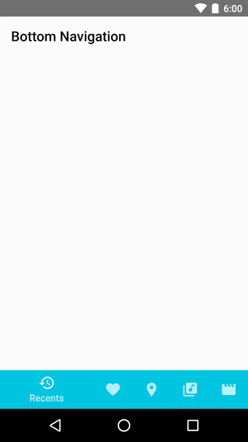
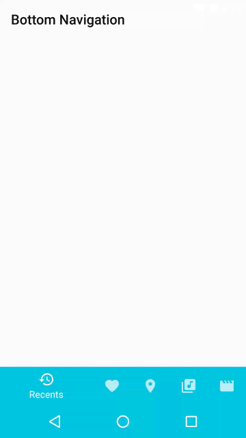
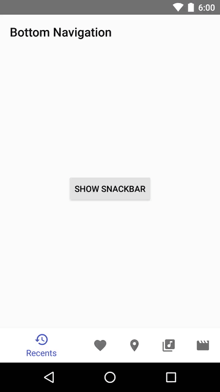
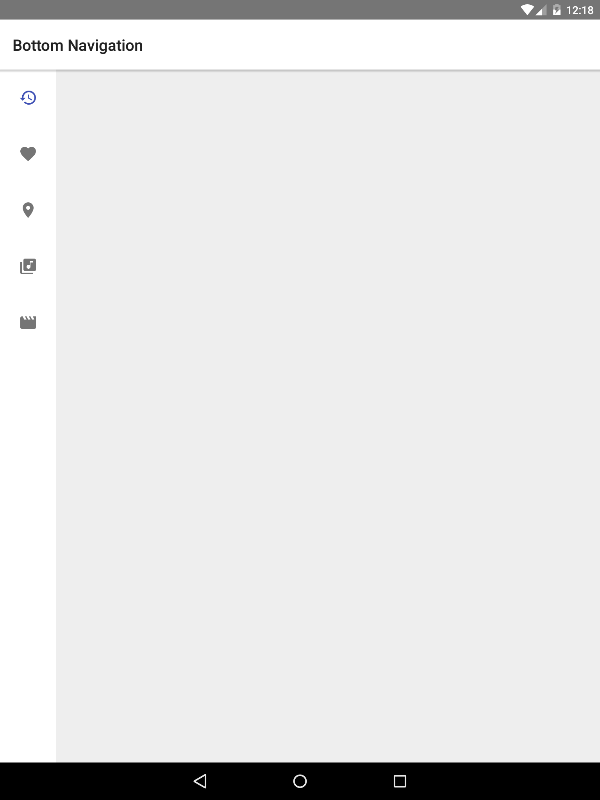
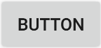
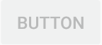
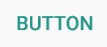

# Material Design Toolbox

Latest version: [](https://jitpack.io/#nasahapps/Material-Design-Toolbox)

Or `master-SNAPSHOT`, which will always compile the latest on the master branch.

*_This library is still a work in progress._*

The main purpose of this library is to provide components and helper methods in implementing [Material Design concepts](http://www.google.com/design/spec/material-design/introduction.html) with little to no effort. This library in particular focuses on components that are not yet included in Google's support libraries, with most widgets adhering very closely to the guidelines Google has set. Links to already-existing components will be provided.

This library supports Android 4.1 (API 16) and up, however, not all components/methods will be supported pre-API 21.

* [Components](#components)
  * [Bottom Navigation](#bottom-navigation)
  * [Bottom Sheets](#bottom-sheets)
  * [Buttons](#buttons)
  * [Lists](#lists)
  * [Steppers](#steppers)
  * [Tabs](#tabs)
  * [Text Fields](#primaryText-fields)
  * [Toolbars](#toolbars)
  * [Tooltips](#tooltips)

## Components

### [Bottom Navigation](https://material.google.com/components/bottom-navigation.html)

`BottomNavigationBar`: Displays three to five tabs for switching between top-level views.

Dependency: ` compile 'com.github.nasahapps.Material-Design-Toolbox:bottomnav:{latest-version}'`

To use, add it to your XML layout:

```xml
<com.nasahapps.mdt.bottomnavigation.BottomNavigationBar
        android:id="@+id/bottomNav"
        android:layout_width="match_parent"
        android:layout_height="wrap_content"
        android:layout_alignParentBottom="true"
        android:layout_gravity="bottom"
        android:background="#fff"
        app:bottomNavigationActiveTint="@color/resource"
        app:bottomNavigationInactiveTint="@color/resource"
        app:bottomNavigationDarkTheme="true|false"
        app:bottomNavigationOrientation="horizontal|vertical"/>
```

Or create it programmatically:

```java
BottomNavigationBar bottomNav = new BottomNavigationBar(context);
```

XML attributes:

|Name|Type|Values|Default|
|:-----|:------|:------|:-----|
bottomNavigationActiveTint | color | | R.attr.colorPrimary
bottomNavigationInactiveTint | color | | R.attr.textColorSecondary
bottomNavigationOrientation | enum | horizontal or vertical | horizontal
bottomNavigationDarkTheme | boolean | | false

You can create new tabs with their primaryText and icon to display, then add them to the bottom nav:

```java
BottomNavigationBar.Tab tab = bottomNav.newTab("Title", drawable);
bottomNav.addTab(tab);
```

If you try to add more than 5 tabs, an Exception will be thrown as that is against Material Design guidelines.

Listen for tab clicks with an `OnTabSelectedListener`:

```java
void onTabSelected(int position);
void onTabUnselected(int position);
void onTabReselected(int position);
```

If your bottom nav has a non-white background and you want the default `inactiveTint` set correctly,
it's best to set `bottomNavigationDarkTheme` to `true`.

If you want the bottom nav background to change colors for each individual tab, you can set those colors
with `setBackgroundColors(@ColorInt int...)` or `setBackgroundColorResources(@ColorRes int...)`.



BottomNavigationBar adjusts appropriately to translucent navigation bars if `android:fitsSystemWindows` is set to `true`:



Snackbars will automatically appear above the BottomNavigationBar, but only if the parent layout is a `FrameLayout`
or a `RelativeLayout`:



BottomNavigationBar has a default Behavior to scroll down if laid out in a CoordinatorLayout:


Setting `bottomNavigationOrientation` to `vertical` will layout the BottomNavigationBar in a vertical fashion,
meant for side navigation:



[BottomNavigationBar Javadoc](library/bottomnav/javadoc/index.html)

### [Bottom Sheets](https://material.google.com/components/bottom-sheets.html)

Dependency: `compile 'com.github.nasahapps.Material-Design-Toolbox:bottomsheets:{latest-version}'`

Bottom sheets are provided by the `design` module in the support library, by the use of [BottomSheetDialog](https://developer.android.com/reference/android/support/design/widget/BottomSheetDialog.html),
[BottomSheetDialogFragment](https://developer.android.com/reference/android/support/design/widget/BottomSheetDialogFragment.html),
or with your own custom View in a CoordinatorLayout using a [BottomSheetBehavior](https://developer.android.com/reference/android/support/design/widget/BottomSheetBehavior.html).

The Material Design Toolbox, however, provides a utils class that will create [a single-choice list styled as a BottomSheetDialog](https://developer.android.com/guide/topics/ui/dialogs.html#AddingAList)
in a similar fashion to how you can already create a single-choice Dialog.

For example, the following code will create and show a BottomSheetDialog with a title and its items aligned in a grid.

```java
new BottomSheetDialogBuilder(context, useGrid)
        .setTitle(title)
        .setItems(items, onClickListener)
        .show();
```

When initializing the `BottomSheetDialogBuilder`, you pass in a `Context` and whether you want the items to be laid
out in a list or in a grid.

The type of item the BottomSheetDialogBuilder accepts is a `BottomSheetItem`, which takes a `CharSequence` title and a `Drawable` icon.
You can also pass in a menu resource instead:

`builder.setItems(R.menu.bottom_sheet, listener)`

The item click listener is very similar to the standard Dialog's OnClickListener:

`void onClick(DialogInterface dialog, int position, int itemId);`

In the `onClick` callback, if you passed in a menu resource instead of a list of items, you can use `itemId`
to refer to the selected item's menu id you set in XML. Else, use `position` for the item's list position.

If you want the icons to all be tinted a certain color, you can use `builder.setIconTint(colorInt)`. Also
you can use `builder.create()` to build the Dialog but not show it yet in case you want to alter the
Dialog any further.

### [Buttons](https://material.google.com/components/buttons.html)

[Buttons](https://developer.android.com/reference/android/widget/Button.html) are a native view widget in the Android SDK.

By default, a Button is untinted.



To have a tinted Button (default color: `colorAccent`), in XML you can set the Button's style:

`style="@style/Widget.AppCompat.Button.Colored"`

and this will automatically tint your button's color to your theme's `colorAccent`.


If you want a color other than `colorAccent` you also must include a custom theme to the Button. For example:

```xml
<style name="CustomButton" parent="@style/ThemeOverlay.AppCompat">
    <item name="colorAccent">#f00</item>
</style>

<Button
    style="@style/Widget.AppCompat.Button.Colored"
    android:layout_width="wrap_content"
    android:layout_height="wrap_content"
    android:primaryText="Button"
    android:theme="@style/CustomButton"/>
```

This results in the following:


To have a disabled button, in XML set `android:enabled="false"`, or in Java, `button.setEnabled(false)`



For a flat-styled button, use `style="@style/Widget.AppCompat.Button.Borderless"` for plain black/white primaryText,
 or `style="@style/Widget.AppCompat.Button.Borderless.Colored"` for the primaryText color to be `colorAccent`



For a rounded button, use the [FloatingActionButton](https://developer.android.com/reference/android/support/design/widget/FloatingActionButton.html)
which is part of the `design` module of the support library.


It automatically themes to your `colorAccent` value. To change this, in XML set `app:backgroundTint="color"`
or in java, `fab.setBackgroundTintList(colorStateList)`.

If you want a mini FAB, in XML set `app:fabSize="mini"` or in java, `fab.setSize(SIZE_MINI)`


The Material Design guidelines also define a "dropdown" button, which is natively just a [Spinner](https://developer.android.com/reference/android/widget/Spinner.html)
in the Android SDK.

### [Lists](https://material.google.com/components/lists.html)

Lists in Android are best done by the use of [RecyclerViews](https://developer.android.com/reference/android/support/v7/widget/RecyclerView.html),
a view widget that is part of the `recyclerview-v7` module of the support library.

This library provides some helper classes for quickly implementing simple lists. The dependency is

`compile 'com.github.nasahapps.Material-Design-Toolbox:base:{latest-version}'`

You can use `SingleLineAdapter` to generate single-lined lists with one line of text and an optional
icon/avatar.


For example:

```java
List<SingleLineItem> items = new ArrayList<>();
items.add(new SingleLineItem("Primary text")); // Adds a SingleLineItem with just text
items.add(new SingleLineItem("Primary text", context.getDrawable(R.drawable.icon)); // Adds a SingleLineItem with text and a left-aligned icon
items.add(new SingleLineItem("Primary text", context.getDrawable(R.drawable.avatar), true); // Adds a SingleLineItem with text and a left-aligned avatar
items.add(new SingleLineItem("Primary text", context.getDrawable(R.drawable.avatar), context.getDrawable(R.drawable.icon)); // Adds a SingleLineItem with text, a left-aligned avatar, and a right-aligned icon

SingleLineAdapter adapter = new SingleLineAdapter(items, listener);
recyclerView.setLayoutManager(new LinearLayoutManager(context));
recyclerView.setAdapter(adapter);
```

Notice for the third `SingleLineItem` constructor the boolean parameter. This is to determine whether
the left-aligned icon should be icon-sized (24x24dp) or avatar-sized (40x40dp). The right-aligned icon
will always be icon-sized (24x24dp).

Use `MultiLineAdapter` to generate multi-lined lists with more than one line of text. If more than three
lines of text are needed, the Material Design guidelines recommend using [Cards](https://material.google.com/components/cards.html) instead.

```java
List<MultiLineItem> items = new ArrayList<>();
items.add(new MultiLineItem("Primary text", "Secondary text")); // Adds a MultiLineItem with just text
items.add(new MultiLineItem("Primary text", "Secondary text", context.getDrawable(R.drawable.icon)); // Adds a MultiLineItem with text and a left-aligned icon
items.add(new MultiLineItem("Primary text", "Secondary text", context.getDrawable(R.drawable.avatar), true); // Adds a MultiLineItem with text and a left-aligned avatar
items.add(new MultiLineItem("Primary text", "Secondary text", context.getDrawable(R.drawable.avatar), context.getDrawable(R.drawable.icon)); // Adds a MultiLineItem with text, a left-aligned avatar, and a right-aligned icon

MultiLineAdapter adapter = new MultiLineAdapter(items, 3, listener); // Initializes a MultiLineAdapter with the given items and set to 3 lines.
recyclerView.setLayoutManager(new LinearLayoutManager(context));
recyclerView.setAdapter(adapter);
```

The second parameter when creating a `MultiLineAdapter` tells the adapter how many lines of text should be
shown before truncating it. This value can be changed with `adapter.setNumberOfLines(int)`.

The `base` module also provides a reusable `OnItemClickListener` that is passed in to either `SingleLineAdapter`
or `MultiLineAdapter`, or can be used by your own Adapter implementation. It provides the following methods:

`void onItemClick(View view, int position)`

which gives the clicked item view and its adapter position.

### [Steppers](https://material.google.com/components/steppers.html)

This library provides two stepper layouts:

`StepperProgressLayout`: Displays step progress using plain primaryText (e.g. Step 4 of 6), dots, or with a tinted ProgressBar. The `StepperProgressLayout` provides "Back" and "Next" buttons for going forwards/backwards between steps, with the "Next" button turning into a "Finish" button on the last step. Also, it is a `ViewGroup`, so any views you add to it will automatically be placed accordingly. (TODO: add pictures)

Custom attributes: 
* stepperMaxProgress 
 * the max number of steps
 * default value: 1
* stepperProgress
 * the current step 
 * default value: 1
* stepperBackButtonText 
 * default value: "Back"
* stepperNextButtonText
 * default value: "Next"
* stepperFinishButtonText
 * the primaryText to be displayed on the "Next" button when on the last step
 * default value: "Finish"
* stepperProgressType
 * the type of progress to be shown, one of TYPE_TEXT, TYPE_DOTS, or TYPE_BAR
 * default value: TYPE_TEXT
* stepperProgressAccent
 * the accent color to use for the dots/bar progress
 * default value: R.attr.colorPrimary

`HorizontalStepperLayout`: Displays steps using `Stepper` views in either a horizontal or vertical fashion. Steppers have one of four states: `COMPLETED`, `ACTIVE`, `INACTIVE`, or `ERROR`. 
Custom attributes:
* stepperLayoutMargin
 * the margin between each Stepper
 * default value: 56dp

Also provided is the `Stepper` widget that should be the only child view used in a `HorizontalStepperLayout`. 
Custom attributes:
* stepperTitle
* stepperSubtitle
* stepperAccent
 * the accent color to be used as the step number background
 * default value: R.attr.colorPrimary
* stepperState
 * the initial state of the stepper (`ACTIVE`, `INACTIVE`, `COMPLETED`, or `ERROR`)
 * default value: `ACTIVE`

### [Tabs](https://material.google.com/components/tabs.html)

The [`TabLayout`](https://developer.android.com/reference/android/support/design/widget/TabLayout.html) widget is part of the `design` support library.

### [Text Fields](https://material.google.com/components/primaryText-fields.html)

The [`TextInputLayout`](https://developer.android.com/reference/android/support/design/widget/TextInputLayout.html) widget is part of the `design` support library. It is suggested to use a `TextInputEditText` instead of a regular `EditText` in this layout.

### [Toolbars](https://material.google.com/components/toolbars.html)

The [`Toolbar`](https://developer.android.com/reference/android/support/v7/widget/Toolbar.html) widget is part of the `appcompat-v7` support library.

### [Tooltips](https://material.google.com/components/tooltips.html)

Tooltips (extends `TextView`) are similar to [`Toasts`](https://developer.android.com/reference/android/widget/Toast.html), both in appearance and in function. Creating a `Tooltip` is very similar to creating a `Toast` or `Snackbar`:

```java
Tooltip.makeTooltip(context, "Tooltip primaryText", Tooltip.LENGTH_SHORT, anchorView).show();
```  

The arguments passed in are a `Context`, string primaryText (or a string resource), a duration of how long you want the `Tooltip` to appear (`LENGTH_SHORT` or `LENGTH_LONG`), and a `View` to anchor the `Tooltip` on. By default, the `Tooltip` will appear below the anchor, unless the anchor is low enough on the screen, then the `Tooltip` will instead appear above the anchor.
